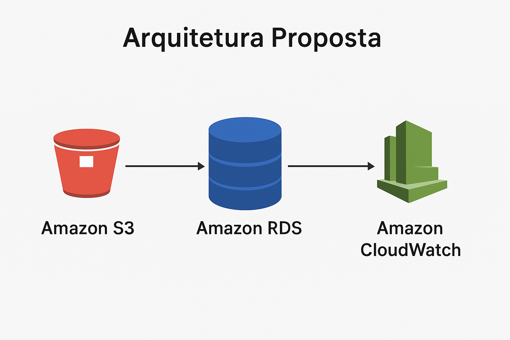

## 🚀 Relatório de Implementação de Serviços AWS - Abstergo Industries

Este projeto apresenta um estudo de caso fictício de implementação de **serviços AWS** na empresa **Abstergo Industries**, com foco em **redução de custos** e **aumento de eficiência**.  
O objetivo é documentar o processo de análise, escolha e implementação de ferramentas em nuvem, simulando um cenário real de migração e otimização.

---

## 📅 Informações do Projeto
- **Data de início:** 21/08/2025  
- **Empresa:** Abstergo Industries  
- **Responsável:** João Guidugli  

---

## 📋 Introdução
Este relatório descreve o processo de implementação de ferramentas da AWS com o objetivo de **diminuir custos imediatos** e preparar a empresa para a **escalabilidade futura**.

Foram selecionados **3 serviços principais** que juntos permitem otimizar armazenamento, banco de dados e monitoramento da infraestrutura.

---

## 🔧 Descrição do Projeto
O projeto de implementação de ferramentas foi dividido em 3 etapas, cada uma com seus objetivos específicos. A seguir, serão descritas as etapas do projeto:

### Etapa 1: Armazenamento
- **Serviço:** Amazon S3  
- **Foco:** Armazenamento em nuvem com custo reduzido.  
- **Caso de uso:** Migração de arquivos locais e backups de sistemas para buckets S3, substituindo soluções físicas caras e melhorando a durabilidade dos dados.

---

### Etapa 2: Banco de Dados
- **Serviço:** Amazon RDS (MySQL)  
- **Foco:** Banco de dados gerenciado.  
- **Caso de uso:** Substituição de servidores locais de banco de dados por instâncias RDS, garantindo **alta disponibilidade**, **escalabilidade** e **redução de custos de manutenção**.

---

### Etapa 3: Monitoramento
- **Serviço:** Amazon CloudWatch  
- **Foco:** Monitoramento de infraestrutura e custos.  
- **Caso de uso:** Implementação de métricas e alarmes para identificar picos de uso, permitindo ajustes automáticos que reduzem custos e melhoram a performance.

---

## 🏗 Arquitetura Proposta
Abaixo está o diagrama da arquitetura implementada:

---

## 💰 Custos Estimados
Os custos estimados foram calculados com base nos preços mensais dos serviços na nuvem e projetados para anual.

| Serviço             | Descrição                           | Custo Mensal Estimado (USD) | Custo Anual Estimado (USD) |
|---------------------|-------------------------------------|-----------------------------|----------------------------|
| Amazon S3           | Armazenamento de arquivos e backups | $25.00                      | $300.00                    |
| Amazon RDS (MySQL)  | Banco de dados gerenciado em nuvem  | $120.00                     | $1,440.00                  |
| Amazon CloudWatch   | Monitoramento e métricas            | $15.00                      | $180.00                    | 

---

## ✅ Conclusão
A implementação dos serviços **Amazon S3, RDS e CloudWatch** proporcionou:  
- Redução imediata de custos operacionais.  
- Maior eficiência no armazenamento e gerenciamento de dados.  
- Monitoramento ativo para otimização contínua.  

Com isso, a empresa está preparada para crescer de forma mais sustentável e escalável, mantendo o controle sobre seus recursos em nuvem.

---

✍️ **Assinatura do responsável pelo projeto:** João Guidugli
